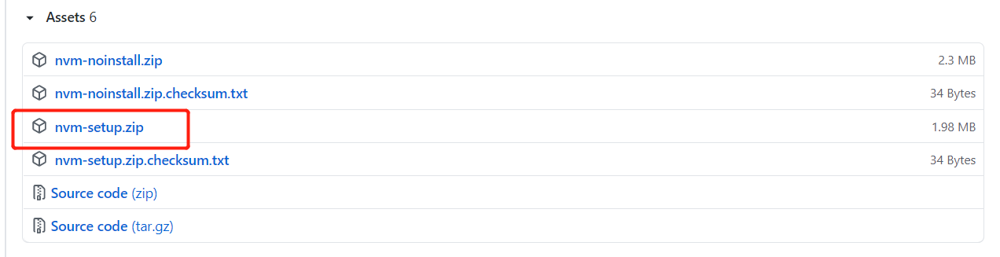

**1、安装gitbook**

1. 安装nvm（nodejs版本管理工具）
2. 下载对应版本的node.js
3. 下载gitbook

**2、安装nvm**

1. [下载nvm包](https://github.com/coreybutler/nvm-windows/releases)，直接安装即可。



**3、使用nvm安装nodejs**

```bash
nvm ls available	# 查看可下载的nodejs本版
nvm ls	# 查看以下载的nodejs版本，且可查看当前使用的nodejs版本
nvm install 12.22.4	# 下载12.22.4版本的nodejs
nvm use 12.22.4	# 使用12.22.4版本的nodejs，若没有标注使用哪个版本默认不使用
nvm uninstall 12.22.4 # 删除12.22.4版本的nodejs
nvm v	# 查看nvm的版本
node -v # 查看node版本
npm -v # 查看npm版本
```

**4、使用npm安装gitbook**

```bash
npm install gitbook-cli -g	# 安装gitbook
gitbook -V	# 查看gitbook版本
gitbook init # 初始化一个gitbook空间
gitbook serve	# 开启gitbook服务
gitbook install	# 下载book.json配置的插件
gitbook build	# 生成静态w
```

**5、book.json配置**

```json
{
  "styles": {
      "website": "styles/website.css"
  },
  "plugins": [
    "chapter-fold",
    "back-to-top-button",
	"splitter",
	"code",
	"local-video"
  ]
}
```

**6、插件使用**

local-video

```html
/**
1、视频播放（需要配置website.css）
.video-js{
	height:100%,
	w
}
*/
<video id="my-video" class="video-js" controls preload="auto" width="100%"
poster="" data-setup='{"aspectRatio":"16:9"}'>
  <source src="../imgs/vedio/detect_encode.mp4" type='video/mp4' >
</video>
```

