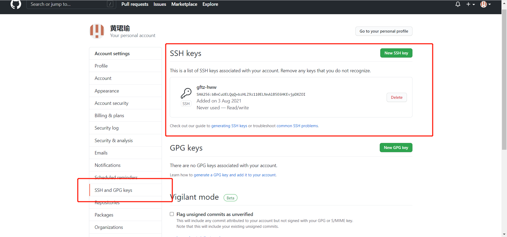

#### 1、生成git密钥并配置

1. 首先需要配置*user.name*和*user.email*，配置完后即可生成密钥。
   ```bash
   git config --global user.name "junyu.huang"	# 配置名称
   git config --global user.email "gftz-hww@163.com"	# 配置邮箱
   ssh-keygen -t rsa -C "gftz-hww@163.com"	# 创建密钥
   ```


2. 生成的密钥在*C:/Users/User/.ssh*文件夹下的id_rsa.pub，将其配置在*GitHub*中的*SSH Keys*即可。

   

   

#### 2、向新的仓库中推内容

1. 初始化要推送的内容所在的文件空间。

2. 链接到GitHub中的指定仓库。

3. 向本地仓库添加内容。

4. 推送本地仓库到远程仓库。

   ```bash
   git init # 初始化要推送的内容所在的文件空间
   git remote add origin "http://github.com/gftz-hww/WorkLogs.git"	# 链接到GitHub中的指定仓库
   # 向本地仓库添加内容
   git add .	
   git commit -m "build a logs repository"	
   git push origin master	# 推送本地仓库到远程仓库
   ```

